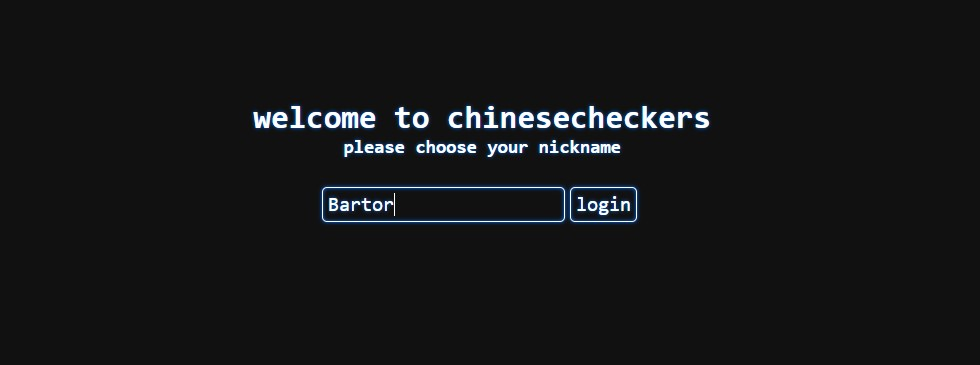
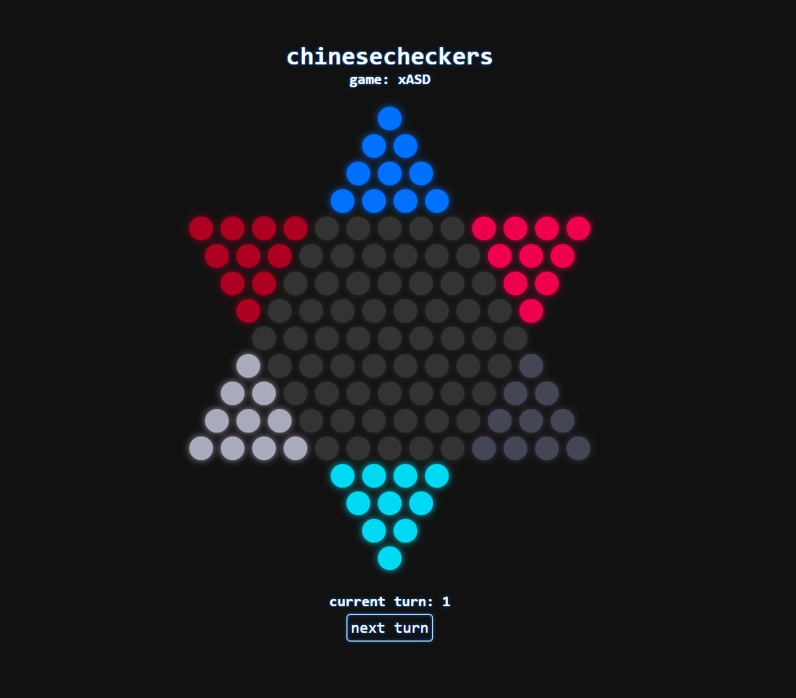

# Web version of chinesecheckers
> Why

~my colleagues

## Introdiction
This is a continuation to the project [chinesecheckers](https://github.com/Bartor/chinesecheckers) from which is uses slightly modified `model` packages to implement server-side game modelling. It's not entirely finished; it can authorize users, create games, lets users join them and make some moves, but it doesn't communicate the moved to the server (as it was to be done using Akka and websockets).

## Structure
It's a pretty basic Play project. It uses two utility classes under [util](app/util). Front end logic is split between each page in [javascripts](public/javascripts).

### Util
There are two utility classes, [BasicGamesContainer](app/util/BasicGamesContainer.java) and [Validator](app/util/Validator.java). Their names are pretty self-explanatory; both are Guice "singletons" injected into controllers to hold games currently being played and authorize users respectively.

### Front end
It looks pretty cool and works pretty good too. It's styled after CRT displays' glow. Take a look:

You can even watch all those fancy effects work in a little presentation [here](https://gfycat.com/AdorableNippyIndochinahogdeer).

## Futher developement
I doubt it'll ever be finished, as it isn't the most exciting thing to work on.